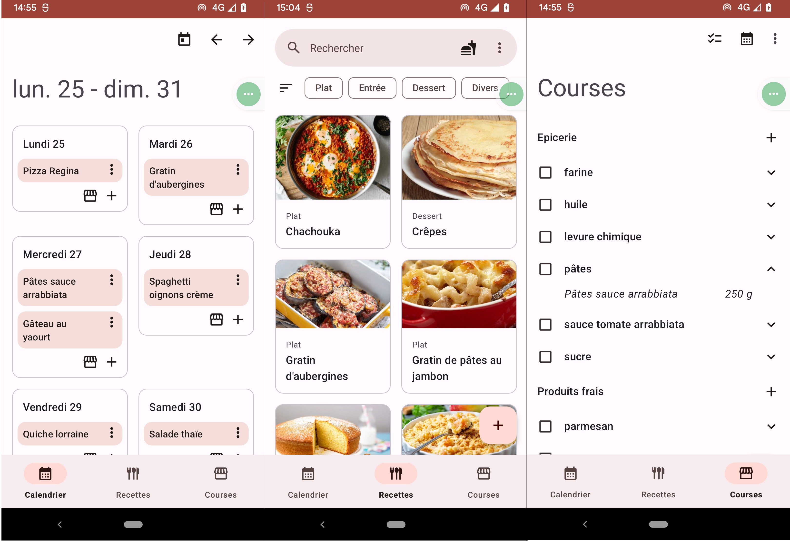

# À Table !

Application android pour organiser les menus et les courses.

## Fonctionnalités

### Agenda des menus

Pour chaque jour des prochaines semaines, indiquer les plats et désserts prévus. Ils peuvent provenir du livre des recettes, mais peuvent aussi être édités à la volée. Une fois les plats ajoutés, une option permet d'ajouter les ingrédients à la liste de courses.

### Livre de recettes

Section d'exploration des recettes ajoutées à l'application. L'exploration peut-être libre, filtrée par type de recette (entrée, plat, dessert etc.) et/ou à partir d'une recherche par mots clés.

Les ingrédients des recettes utilisent des unités génériques préalablement établies dans l'application. Cela permet le regroupement d'ingrédients similaires lors de la génération de la liste de courses.

### Liste de courses

Générée à chaque ouverture de la liste.

## Etapes de développement

- [X] Données
  - [X] Structures de données
    - [X] Base de données
    - [X] Entité pour les recettes
    - [X] Entité pour les plats de l'agenda
    - [X] Entité pour les éléments des courses
    - [ ] Classe de la liste de courses
    - [ ] Entité pour les produits alimentaires (et leur unité)
    - [ ] Entité pour l'inventaire des produits
  - [ ] Manipulation des données
    - [ ] Produits des courses => liste des courses
- [X] Interface
  - [X] Agenda
  - [X] Recettes
  - [X] Courses
  - [ ] Inventaire
  - [ ] Produits

### Produits

Pour l'instant, un ingrédient dans une recette ou un produit dans la liste des courses sont représentés par 3 éléments :

* Une valeur
* Une unité
* Un intitulé

Alors que la liste des unités et leur conversion possibles entre elles sont mentionnées dans un array constant, l'intitulé est une chaîne de caractère librement décidée par l'utilisateur.

Il s'agirait maintenant d'avoir une table SQL pour les produits/ingrédients. L'application offrirait un ensemble conséquent de produits pré-établis (une table SQL déjà fournie). Lors de l'écriture de la recette, l'utilisateur aurait à choisir dans ces produits ou ajouter un nouveau produit.

La création d'une table de base de données pour cet objet offrirait l'avantage de faciliter le regroupement de produits similaires dans la liste de courses, mais aussi d'ajouter un inventaire (lui aussi représenté par une table SQL) lorsqu'un produit est checké dans la liste des courses.

### Inventaire

L'inventaire repertorirait les ingrédients/produits achetés. Deux moyens sont envisagés pour founir cet inventaire :

* lors du check d'un ingrédient/produit dans la liste des courses : l'appli demanderait une date de péremption et/ou ajouterait le produit à l'inventaire.
* après chaque course, l'utilisateur serait chargé de scanner ses produits, lier les achats scannés à un produit archivé (si cela n'a pas encore été fait) et le tout serait ajouté à l'inventaire.

Par la suite, la page de l'inventaire offrirait les fonctionnalités suivantes :

* la mise à jour des produits de l'inventaire
* les produits qui perimeront très rapidement
* les recettes les plus adaptées pour les produits disponibles
